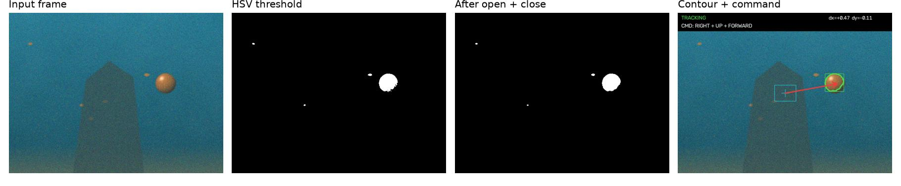

# Color-Based Object Tracking for ROV Navigation

A real-time Python + OpenCV tracker that finds a colored target (such as a buoy) in video, estimates its offset
from the image center and turns that offset into guidance commands for an underwater vehicle
(**yaw LEFT/RIGHT, heave UP/DOWN, surge FORWARD/STOP, SEARCH**).

**Live demo:** [https://emreyoleridev-rov-color-tracking-app-97t4lr.streamlit.app/](https://emreyoleridev-rov-color-tracking-app-97t4lr.streamlit.app/)



Pipeline: Gaussian blur → **HSV segmentation** (with red hue wrap-around) → **morphological opening + closing** →
**contour analysis** (largest contour above a minimum area, moments → centroid) → EMA smoothing with coasting →
**dead-zone guidance law**.

| Synthetic scenario (300 frames × 2 seeds) | Detection | Centroid err | Command accuracy | Speed |
|---|---|---|---|---|
| clear | 100 % | 1.0 px | 95.7 % | 2–4 ms/frame |
| turbid | 100 % | 5.5 px | 95.7 % | |
| noisy + sediment | 100 % | 1.5 px | 96.0 % | |
| distractor fish | 100 % | 1.1 px | 95.8 % | |
| occlusion | 100 % | 1.3 px | 96.4 % | |
| hard (all effects) | 100 % | 4.7 px | 96.1 % | |

Full analysis, ablation study and parameter sensitivity: **[REPORT.md](REPORT.md)**

## Quick start

```bash
python -m venv .venv && source .venv/bin/activate
pip install -r requirements.txt
streamlit run app.py              # web app at http://localhost:8501
python scripts/evaluate.py        # benchmark: CSVs, figures and demo video in results/
```

## Web app

* **Image / Camera:** synthetic frame, uploaded photo or webcam snapshot. Live HSV, morphology and guidance
  sliders. Shows the raw and cleaned masks, the overlay and the command, and can auto-calibrate the HSV range
  from an image region.
* **Video:** upload a video or generate a synthetic underwater scenario (clear / turbid / noisy / distractors /
  occlusion / hard). Shows the annotated video, the dx/dy timeline, the command distribution and the accuracy
  against ground truth. The annotated MP4 and the command log CSV can be downloaded.
* **Benchmark / Report:** evaluation results and this project's report.

## Project layout

```
tracker/core.py       segmentation, morphology, contours, guidance law, ColorTracker, overlay
tracker/synth.py      synthetic underwater video generator with ground truth
tracker/video.py      video reading + browser-playable H.264 writing
scripts/evaluate.py   benchmark, ablation, S_min sensitivity, figures
app.py                Streamlit app
results/              summary.csv, ablation.csv, sensitivity_smin.csv, per_frame_log.csv, figures/, demo_hard.mp4
REPORT.md             project report
```

## Using the library

```python
import cv2
from tracker import ColorTracker, TrackerConfig, PRESETS, draw_overlay

cfg = TrackerConfig(lower=PRESETS["Orange buoy"][0], upper=PRESETS["Orange buoy"][1])
tracker = ColorTracker(cfg)
cap = cv2.VideoCapture("dive.mp4")
while True:
    ok, frame = cap.read()
    if not ok:
        break
    res = tracker.update(frame)
    print(res.command.text, res.command.yaw_rate, res.command.heave_rate)
    cv2.imshow("track", draw_overlay(frame, res, cfg))
    cv2.waitKey(1)
```
