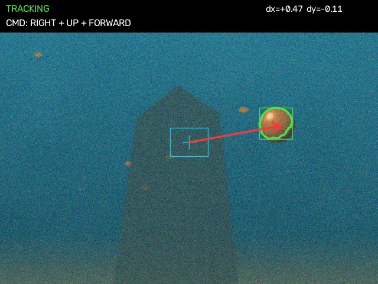
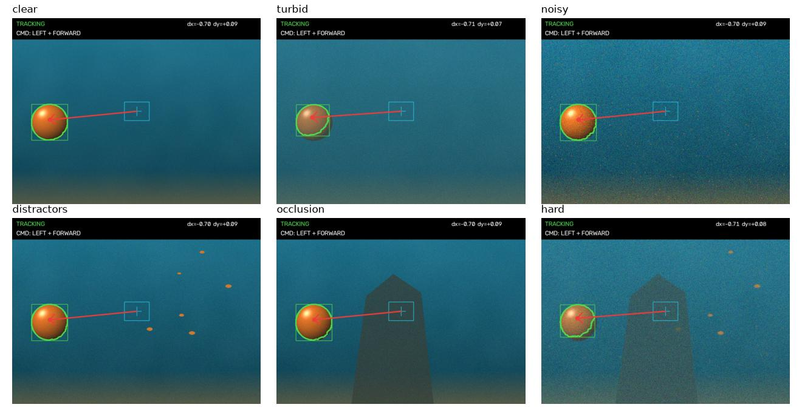
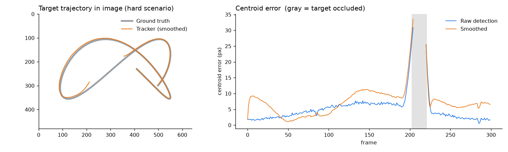
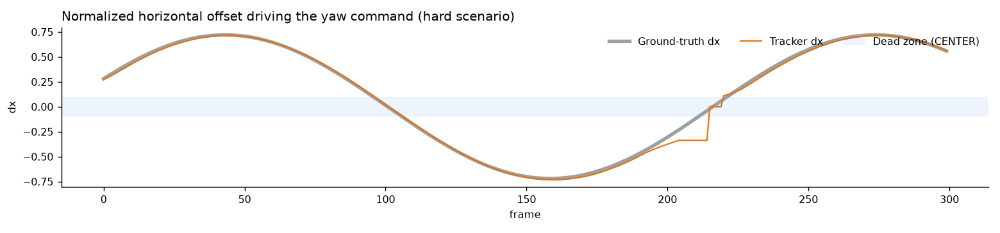
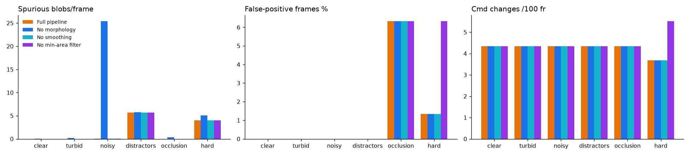
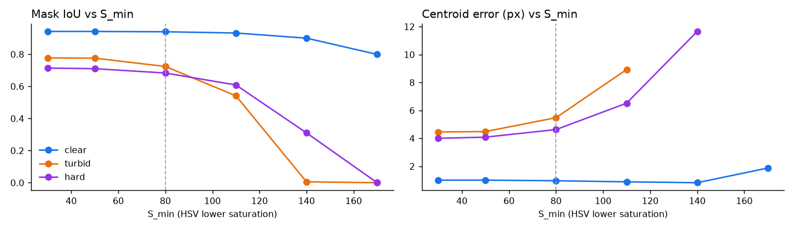

# Color-Based Object Tracking for ROV Navigation — Project Report

## 1. Problem

A remotely operated vehicle (ROV) often has to approach a known, brightly colored target: a mooring buoy, a
docking marker, a pipeline tag or a competition gate. The goal of this project is a lightweight, real-time
vision module in Python + OpenCV that

1. finds a colored target in each video frame,
2. estimates where it is relative to the camera's optical axis, and
3. turns that offset into simple guidance commands (yaw left/right, heave up/down, surge forward/stop).

No learning is involved. The method is classical image processing with interpretable, tunable parameters, so it
runs on an embedded CPU at hundreds of frames per second and can be tuned at the dive site without retraining.

## 2. Pipeline


All code is in `tracker/core.py`.

| Step | Operation | Why |
|---|---|---|
| 1 | **Gaussian blur** (5×5) | Suppresses sensor noise before thresholding |
| 2 | **BGR → HSV**, `cv2.inRange` on `[H, S, V]` bounds | Hue separates *what color* from *how bright*, so the mask survives uneven lighting. A wrap-around range (H_low > H_high) handles red, which straddles H = 0 |
| 3 | **Morphological opening** (5×5 ellipse) | Erodes then dilates: removes isolated specks (sediment, noise) |
| 4 | **Morphological closing** (9×9 ellipse) | Dilates then erodes: fills holes left by specular highlights and shadows on the target |
| 5 | **External contours** (`cv2.findContours`), discard area < `min_area` | Rejects small same-colored objects (fish, debris) |
| 6 | **Largest contour → image moments** | Centroid `(cx, cy) = (m10/m00, m01/m00)`, area, bounding box, circularity `4πA/P²` |
| 7 | **Temporal filter** | Exponential moving average of `(cx, cy, area)` with α = 0.5; when detection fails the estimate is held (COASTING) for `max_lost` = 10 frames, then the state becomes SEARCHING |
| 8 | **Guidance law** | See below |

### Guidance law

With a frame of width *W* and height *H*, the normalized offsets are

    dx = (cx − W/2) / (W/2)        dy = (cy − H/2) / (H/2)        ∈ [−1, 1]

* **Yaw:** `|dx| < deadzone` → CENTER, otherwise LEFT (dx < 0) or RIGHT (dx > 0)
* **Heave:** `|dy| < deadzone` → LEVEL, otherwise UP (dy < 0) or DOWN (dy > 0)
* **Surge:** FORWARD until the target fills `stop_area` (8 %) of the frame, then STOP. The apparent area is a
  proxy for distance, since a sphere's image area scales with 1/distance²
* **Lost target:** SEARCH (rotate in place)

The dead zone (default 10 % of the half-frame) prevents thruster chatter when the target is almost centered. The
module also outputs proportional rates (`yaw_rate = dx`, `heave_rate = dy`, zero inside the dead zone), which could
feed a P-controller directly.



On the overlay, the cyan box is the dead zone, the green contour is the selected target, yellow contours are
rejected candidates, and the red arrow is the correction vector from the image center.

## 3. Evaluation setup

Real ROV footage with frame-accurate target positions is rarely public. So I wrote a **synthetic underwater video
generator** (`tracker/synth.py`) that renders a shaded orange buoy following a known Lissajous path and growing as
the vehicle "approaches" it. This gives exact ground truth for every frame. The water model includes:

* a depth gradient (teal → dark blue), seabed and low-frequency backscatter blotches
* **turbidity:** the frame is blended toward the water color, which desaturates and hazes the target
* Gaussian sensor noise, brightness flicker and defocus blur
* **sediment particles:** 400–500 random 1–2 px reddish specks per frame (color noise inside the target's hue band)
* **distractors:** small orange fish moving across the scene
* **occlusion:** a rock the buoy passes behind (frames where < 25 % of the buoy is visible count as "not visible")



Six scenarios × 300 frames × 2 random seeds, 640×480. Metrics:

| Metric | Definition |
|---|---|
| Detection rate | Visible frames where the detected centroid lies inside the true buoy radius |
| False-positive frames | Frames with a detection that is either off-target or made while the buoy is "not visible" |
| Centroid error | Euclidean distance (px) between detected and true center |
| Mask IoU | Overlap of the cleaned mask with the true visible buoy disk |
| Command accuracy | Share of visible frames where yaw / heave / surge match the commands computed from ground truth |
| Spurious blobs | Extra connected components left in the cleaned mask |
| Command changes | How often the command text changes per 100 frames (chatter) |
| FPS | Tracker-only throughput (rendering excluded), one CPU core, Apple Silicon laptop |

Run it with `python scripts/evaluate.py`.

## 4. Results

| Scenario | Detection % | FP frames % | Centroid err (px) | Mask IoU | Yaw acc % | Heave acc % | Surge acc % | **Full cmd acc %** | FPS |
|---|---|---|---|---|---|---|---|---|---|
| clear | 100 | 0.0 | 0.96 | 0.94 | 98.3 | 97.3 | 100 | **95.7** | ~260 |
| turbid | 100 | 0.0 | 5.48 | 0.72 | 98.7 | 97.0 | 100 | **95.7** | ~530 |
| noisy | 100 | 0.0 | 1.45 | 0.92 | 98.3 | 97.7 | 100 | **96.0** | ~290 |
| distractors | 100 | 0.0 | 1.05 | 0.76 | 98.3 | 97.5 | 100 | **95.8** | ~430 |
| occlusion | 100 | 6.3 | 1.28 | 0.93 | 98.9 | 97.5 | 100 | **96.4** | ~480 |
| hard (all effects) | 100 | 1.3 | 4.65 | 0.69 | 98.9 | 97.2 | 100 | **96.1** | ~490 |

* The visible target is found in **every** frame of every scenario, and the generated command matches the
  ground-truth command in **~96 %** of frames.
* Per-axis accuracy is 97–99 %. Nearly all mismatches happen in the frames where the target crosses a dead-zone
  edge. There, the EMA lags the true position by a frame or two, so the command switches slightly late (see the
  ablation below).
* The tracker needs **2–4 ms per 640×480 frame**, which is far above the 25–30 FPS of a typical ROV camera. FPS
  values vary because other jobs were running on the machine during the benchmark.
* **Turbidity is the hardest effect.** Haze desaturates the shadowed half of the buoy below the S threshold.
  The mask then covers mainly the lit half (IoU 0.72), which biases the centroid by about 5 px toward the light.
  The command is still right, because a 5 px bias is small next to the 32 px dead zone.
* In the occlusion scenario, the "false positives" are frames where only a thin sliver of the buoy (< 25 %) peeks
  out from behind the rock and is still detected. These are technically correct detections, but they are scored
  strictly.



The smoothed trajectory follows the ground truth closely. During the occlusion (gray band) the tracker coasts on
the last estimate, then snaps back once the buoy reappears.



## 5. Ablation study

Each component was removed in turn (`results/ablation.csv`).



| Removed component | Effect |
|---|---|
| **Morphological filtering** | In the *noisy* scenario the mask keeps **25.4 spurious blobs per frame** (vs 0.01), and mask IoU drops from 0.92 to 0.87. The largest-contour rule still picks the buoy, but any downstream step that uses the mask (multi-target, shape checks) would be flooded with noise |
| **Min-area filter** | In *hard*, false-positive frames rise from **1.3 % → 6.3 %** and command changes from 3.7 → 5.5 per 100 frames. When the buoy hides behind the rock, the tracker locks onto an orange fish and steers toward it |
| **Temporal smoothing** | Command accuracy goes *up* by 1.5–3 pp (e.g. clear 95.7 → 98.7 %), with no change in chatter |

The smoothing result is an honest negative finding. The synthetic camera is perfectly steady and the
segmentation is very stable, so the EMA only adds lag. On a real ROV, wave-induced pitch/roll and
flickering caustics make raw measurements jitter, and that is where smoothing earns its place. α is a slider in
the app (α = 1 disables it), so it can be tuned to the footage.

## 6. Sensitivity to the saturation threshold

The lower saturation bound `S_min` is the most important parameter.



| S_min | clear IoU | turbid IoU | turbid err (px) | hard IoU | hard spurious blobs |
|---|---|---|---|---|---|
| 30 | 0.94 | 0.78 | 4.5 | 0.71 | 3.9 |
| 50 | 0.94 | 0.78 | 4.5 | 0.71 | 3.9 |
| **80 (default)** | **0.94** | **0.72** | **5.5** | **0.68** | **3.9** |
| 110 | 0.93 | 0.54 | 8.9 | 0.61 | 2.5 |
| 140 | 0.90 | 0.01 (lost) | — | 0.31 | 0.0 |
| 170 | 0.80 | 0.00 (lost) | — | 0.00 | 0.0 |

A high `S_min` is safe in clear water but loses the target entirely once turbidity desaturates it. A very low
value lets background noise in. An earlier version of the preset used `S_min = 120`. The sweep showed that it
roughly doubled the turbid centroid error (10.7 px vs 5.5 px), so the default was lowered to 80.

## 7. Interactive app

`app.py` (Streamlit) lets a user test the tracker without writing code:

* **Image / Camera:** run on a synthetic frame, an uploaded photo or a **webcam snapshot**. See the raw HSV mask,
  the cleaned mask, the segmented target, the overlay and the command, all updated live as the sliders move.
  An **auto-calibrate** tool sets the HSV range from a region of the image (5th–95th percentiles, with red
  wrap-around handled).
* **Video:** track an uploaded video or a freshly generated synthetic scenario. The app shows the annotated
  H.264 video (optionally with the mask side by side), the dx/dy timeline (with ground truth for synthetic
  videos), the command distribution and the accuracy against ground truth. The annotated video and the per-frame
  command log (CSV) can be downloaded.
* **Benchmark** and **Report** tabs show these results.

## 8. Limitations and future work

* **Color-only.** Any large object of the same hue wins the largest-contour rule. Possible fixes: shape gating
  (circularity is already computed), a size prior from the previous frame, or gating detections to a window
  around the predicted position.
* **Color constancy.** Water absorbs red light first, so an orange buoy turns brown and then gray with depth and
  distance. Underwater white balance / red-channel compensation before segmentation (see the companion
  *underwater-image-enhancement* project) would widen the working range. So would adapting the HSV range online
  from the tracked region.
* **Smoothing.** Replacing the EMA with a constant-velocity **Kalman filter** would remove the lag (it predicts
  instead of averaging) and give a principled prediction during occlusion.
* **Distance.** Area is only a relative proxy. With a known buoy diameter *D* and focal length *f*, range ≈
  *f·D / (2r)* gives metric distance for a proper surge controller.
* **Synthetic evaluation.** The generator is simple. Validating on real footage, such as pool tests or
  RoboSub/TAC competition recordings with hand-labelled centers, is the natural next step.

## 9. Reproducing

```bash
pip install -r requirements.txt
python scripts/evaluate.py     # ~5 min: CSVs, summary.md, figures, demo video in results/
streamlit run app.py
```
